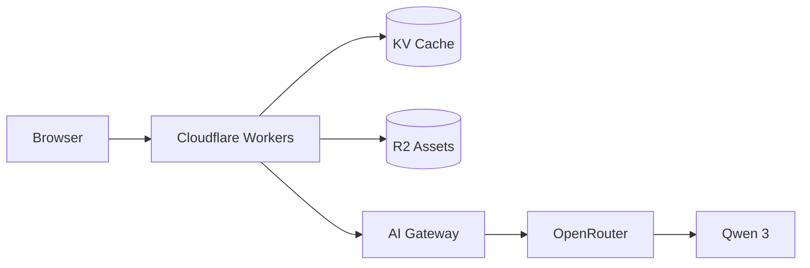
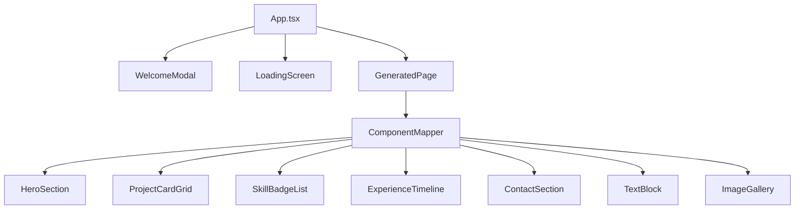
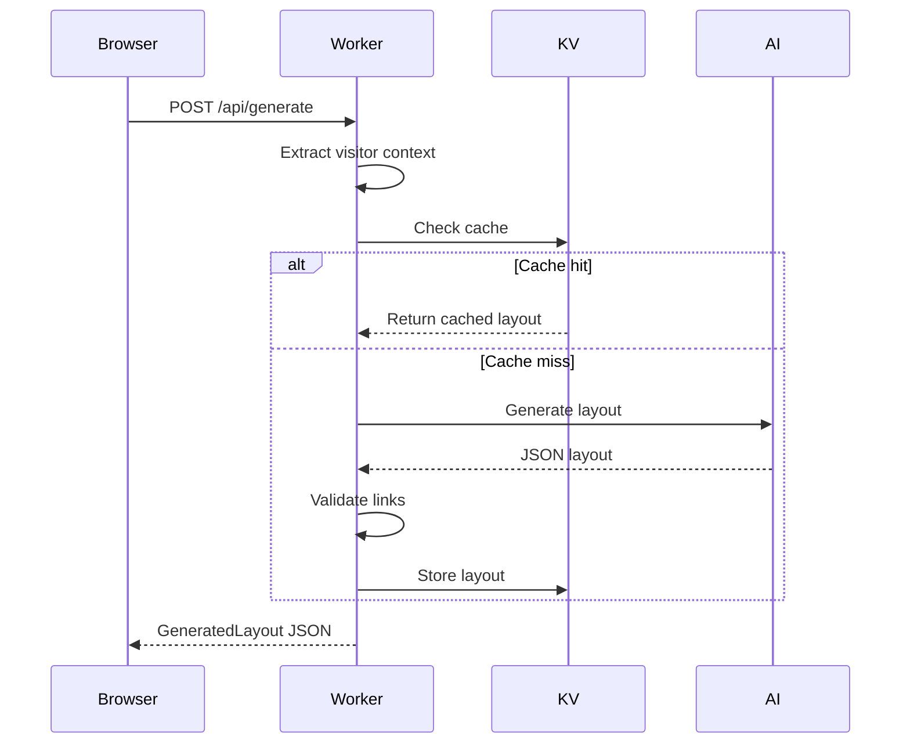

# Architecture

This portfolio uses AI to generate personalized layouts at the edge. Visitors select their intent, and Cloudflare Workers calls an LLM to create a custom UI configuration that React renders using pre-built components.

## System Overview



**Components:**
- **Cloudflare Workers** - Edge runtime serving both API and static assets
- **KV** - Caches generated layouts by visitor type (24h TTL)
- **R2** - Stores static assets (images, favicon)
- **AI Gateway** - Routes and monitors LLM requests
- **OpenRouter** - LLM provider routing to Qwen 3 Coder Flash

## Frontend Architecture



**Flow:**
1. `App.tsx` manages state (visitor type, layout, loading)
2. `WelcomeModal` captures visitor intent
3. `GeneratedPage` receives AI-generated layout JSON
4. `ComponentMapper` dynamically renders section components

## API Request Flow



## Key Files

| File | Purpose |
|------|---------|
| `worker/index.ts` | API endpoints, caching, rate limiting |
| `worker/prompts.ts` | System and user prompts for AI |
| `src/App.tsx` | Main React component, state management |
| `src/components/ComponentMapper.tsx` | Maps AI JSON to React components |
| `src/components/sections/*` | Pre-built portfolio section components |
| `src/content/portfolio.json` | Portfolio data (projects, skills, etc.) |

## Data Flow

```
portfolio.json → Worker prompt → AI → GeneratedLayout JSON → ComponentMapper → React UI
```

1. **Portfolio content** is embedded in the AI system prompt
2. **AI generates** a `GeneratedLayout` with layout type, theme, and sections array
3. **Each section** has a `type` (component name) and `props` (configuration)
4. **ComponentMapper** looks up the component and passes props
5. **React renders** the personalized portfolio
