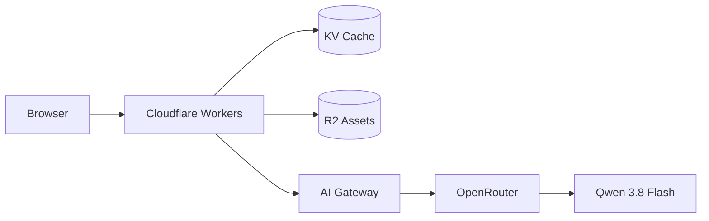
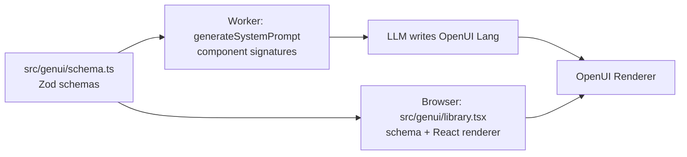
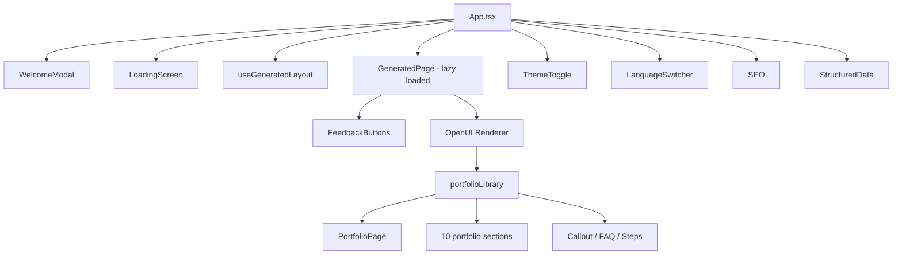
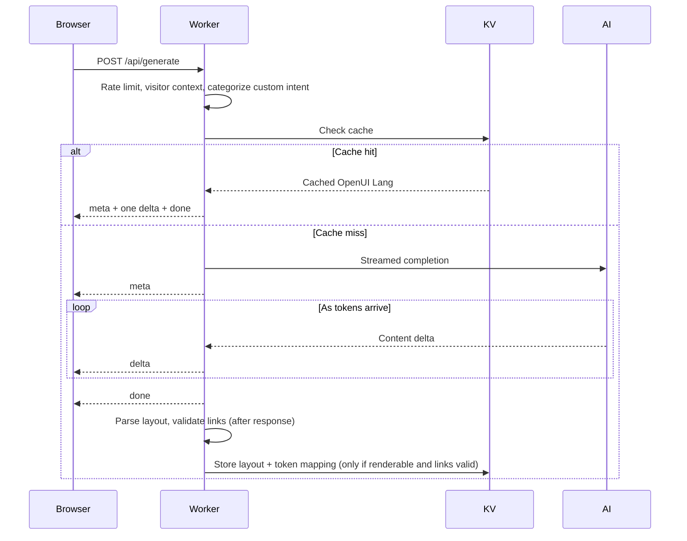

# Architecture

This portfolio uses AI to generate personalized layouts at the edge. Visitors select their intent, a Cloudflare Worker asks an LLM to compose a page from pre-built components, and the page streams into the browser section by section. Generation uses [OpenUI](https://www.openui.com/): the model writes OpenUI Lang, a compact UI language, which the browser parses and renders as it arrives.

## System Overview


```mermaid
flowchart LR
    Browser --> Workers[Cloudflare Workers]
    Workers --> KV[(KV Cache)]
    Workers --> R2[(R2 Assets)]
    Workers --> Gateway[AI Gateway]
    Gateway --> OpenRouter
    OpenRouter --> Qwen[Qwen 3.8 Flash]
```

**Components:**
- **Cloudflare Workers** - Edge runtime serving both API and static assets
- **KV** - Caches generated layouts by visitor type and context (24h TTL)
- **R2** - Stores static assets (images, favicon)
- **AI Gateway** - Routes and monitors LLM requests
- **OpenRouter** - LLM provider routing to `qwen/qwen3.8-flash` (`AI_MODEL` in `worker/index.ts`)

## The Component Contract

`src/genui/schema.ts` defines every component the model may use as a Zod schema. It is the single source of truth, shared by both sides:


```mermaid
flowchart LR
    Schema[src/genui/schema.ts<br/>Zod schemas] --> Prompt[Worker: generateSystemPrompt<br/>component signatures]
    Schema --> Library[Browser: src/genui/library.tsx<br/>schema + React renderer]
    Prompt --> Model[LLM writes OpenUI Lang]
    Model --> Renderer[OpenUI Renderer]
    Library --> Renderer
```

- The **Worker** turns the schemas into the system prompt, so the model is told exactly which components, props and enum values exist.
- The **browser** pairs each schema with a React renderer. The 10 portfolio sections (`src/components/sections/*`) keep their own design; `Callout`, `FAQ` and `Steps` come from `@openuidev/react-ui`, themed to the site through the `.genui` token bridge in `src/index.css`.
- The root `PortfolioPage` component owns the page layout and applies the model's accent colour.

Keep schemas strict: they are rendered verbatim into the prompt. The OpenUI parser only checks component names and required props, so each renderer re-validates with `sanitizeProps` (`src/genui/sanitize.ts`), which drops unsafe links, images outside `/assets`, and invalid optional values rather than the whole section.

To add a component, add its schema and description to `componentDefinitions` in `schema.ts` and its renderer to `library.tsx`. The prompt updates automatically.

## Frontend Architecture


```mermaid
flowchart TD
    App[App.tsx] --> Modal[WelcomeModal]
    App --> Loading[LoadingScreen]
    App --> Hook[useGeneratedLayout]
    App --> Page[GeneratedPage - lazy loaded]
    App --> Theme[ThemeToggle]
    App --> Lang[LanguageSwitcher]
    App --> SEO[SEO]
    App --> Schema[StructuredData]
    Page --> Feedback[FeedbackButtons]
    Page --> Renderer[OpenUI Renderer]
    Renderer --> Library[portfolioLibrary]
    Library --> Root[PortfolioPage]
    Library --> Sections[10 portfolio sections]
    Library --> ReactUI[Callout / FAQ / Steps]
```

**Flow:**
1. `WelcomeModal` captures visitor intent; the generated-page bundle is prefetched meanwhile
2. `useGeneratedLayout` streams `POST /api/generate`, accumulating OpenUI Lang
3. `LoadingScreen` shows only until the first content arrives
4. `GeneratedPage` renders the growing text through OpenUI's `Renderer`, so sections appear as they stream in
5. If the request fails before any content arrives, the shared fallback layout (`src/genui/fallback.ts`) is shown

## API Request Flow

`POST /api/generate` responds with a server-sent event stream (`src/genui/protocol.ts`):

| Event | Data |
|-------|------|
| `meta` | Always first: layout source (`ai`, `cache` or `fallback`), layout token, categorization, visitor context, UI hints |
| `delta` | `{ text }`: OpenUI Lang to append. A cache hit or fallback arrives as a single delta |
| `error` | Generation failed after content was sent; the client keeps what rendered |
| `done` | Always last |


```mermaid
sequenceDiagram
    participant Browser
    participant Worker
    participant KV
    participant AI

    Browser->>Worker: POST /api/generate
    Worker->>Worker: Rate limit, visitor context, categorize custom intent
    Worker->>KV: Check cache
    alt Cache hit
        KV-->>Worker: Cached OpenUI Lang
        Worker-->>Browser: meta + one delta + done
    else Cache miss
        Worker->>AI: Streamed completion
        Worker-->>Browser: meta
        loop As tokens arrive
            AI-->>Worker: Content delta
            Worker-->>Browser: delta
        end
        Worker-->>Browser: done
        Worker->>Worker: Parse layout, validate links (after response)
        Worker->>KV: Store layout + token mapping (only if renderable and links valid)
    end
```

Only `delta.content` from the model is forwarded, so reasoning or other metadata can never reach the page. If the model fails before sending anything, the Worker streams the fallback layout instead.

**Dislike / regenerate:** the `meta` event carries an opaque `layoutToken`. The Worker maps it to the cache key in KV, so a dislike invalidates exactly that layout; clients never see or send raw cache keys.

## Key Files

| File | Purpose |
|------|---------|
| `src/genui/schema.ts` | Component contract: Zod schemas shared by Worker and browser |
| `src/genui/library.tsx` | React renderers for each component, with prop sanitization |
| `src/genui/protocol.ts` | Server-sent event format for `/api/generate` |
| `src/genui/useGeneratedLayout.ts` | Streams a layout into React state |
| `src/genui/fallback.ts` | Default layout used by both Worker and browser |
| `worker/index.ts` | API endpoints, streaming, caching, rate limiting |
| `worker/genui-stream.ts` | Reads model deltas; parses and inspects finished layouts |
| `worker/prompts.ts` | Prompts; the component section is generated from the contract |
| `src/components/sections/*` | Pre-built portfolio section components |
| `src/content/portfolio.json` | Portfolio data (projects, skills, etc.) |

## Data Flow

```
portfolio.json + schema.ts → Worker prompt → AI → OpenUI Lang (streamed) → Renderer → React UI
```

1. **Portfolio content** and the generated **component signatures** form the system prompt
2. **The AI writes** OpenUI Lang, root first: `root = PortfolioPage("two-column", "blue", [hero, work])`, then each section
3. **The browser** re-parses the text as each delta arrives; references resolve as their definitions stream in
4. **Renderers** validate each section's props against the schema and render it
5. **Project and experience IDs** from the model are resolved against `portfolio.json`; unknown IDs are dropped
